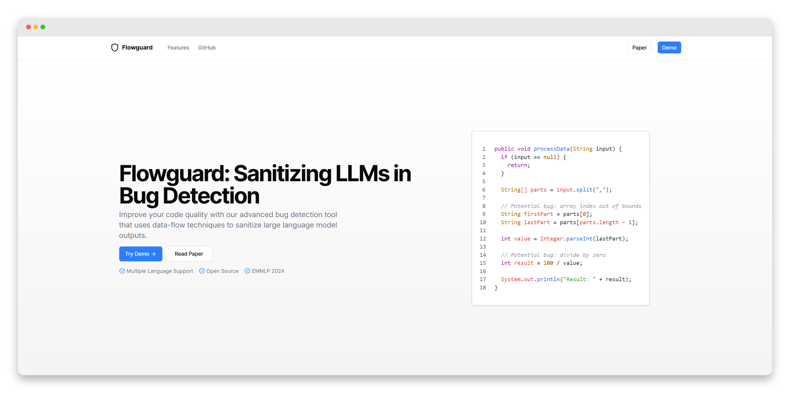

# Flowguard

A bug detection web application built on top of [LLMSAN](https://github.com/chengpeng-wang/LLMSAN) (EMNLP 2024, Purdue University). LLMSAN raises LLM-based Java bug-detection precision from ~69% to ~91% by requiring the model to emit a data-flow path as proof, then validating it through four sanitizer passes. Flowguard wraps this pipeline in a production-ready FastAPI backend and a Next.js frontend.



## Project Structure

```
IE105/
├── flowguard-api/          # FastAPI backend
│   ├── Dockerfile
│   └── app/
│       ├── main.py
│       ├── api/v1/routes/  # analysis.py, fix.py, health.py
│       ├── core/           # pipeline, detector, sanitizer, parser, prompts
│       └── schemas/        # request/response models
├── flowguard-web/          # Next.js frontend
│   ├── app/
│   │   ├── page.tsx
│   │   └── api/            # proxy routes to backend
│   └── components/         # tab-editor, tab-result, tab-sanitize, code-block
└── .github/workflows/
```
---

## Features

- Upload and analyze source code for bugs
- One-click code sanitization using LLMs
- Supports multiple bug types: NPD, DBZ, CI, APT, XSS
- Multi-language support via Tree-sitter grammars

## Getting Started

### Prerequisites

- Docker
- Node.js 20+
- An OpenAI API key

### Backend

```bash
cd flowguard-api

# Create .env
cat > .env <<EOF
OPENAI_API_KEY=sk-...
NEURAL_SANITIZE_STRATEGY_FUNCTIONALITY=True
NEURAL_SANITIZE_STRATEGY_REACHABILITY=True
EOF

# Build and run
docker build -t flowguard-api .
docker run --rm -p 8000:8000 --env-file .env flowguard-api
```

The API is now available at `http://localhost:8000`.

> The Docker build compiles the tree-sitter Java shared library automatically — no manual build step needed.

### Frontend

```bash
cd flowguard-web

npm install

# Create .env.local
cat > .env.local <<EOF
NEXT_PUBLIC_API_URL=http://localhost:8000
EOF

npm run dev
```

The app is now available at `http://localhost:3000`.

---

## API Endpoints

You can configure the analysis by specifying parameters in the API requests.

### `/api/v1/health`

- **Method:** GET
- **Response:** Service liveness status.

### `/api/v1/analyze`

- **Method:** POST
- **Parameters:**
  - `file`: Source code file to analyze (`UploadFile`).
  - `bug_type`: Type of bug (`apt`, `ci`, `dbz`, `npd`, `xss`).
  - `model_name`: LLM model for detection (e.g., `gpt-4.1-mini`).
- **Response:** Streaming NDJSON with analysis results.

### `/api/v1/fix`

- **Method:** POST
- **Parameters:**
  - `file_name`: Name of the file to fix (string, e.g., `example.java`).
  - `bug_type`: Type of bug (default: `dbz`).
  - `model_name`: LLM model for fix generation (default: `gpt-4.1-mini`).
- **Response:** Fixed code and list of changes as JSON.

---

## CI/CD Pipeline

```
push / PR to main (flowguard-api/** changes)
        │
        ├─▶ ruff check          (lint)
        ├─▶ pytest              (unit tests)
        ├─▶ docker build        (multi-stage image)
        └─▶ trivy image scan    (CRITICAL CVEs → fail)
```

Defined in `.github/workflows/deploy-backend.yaml`.

---

## More Programming Languages

LLMSAN is language-agnostic. To migrate the current implementations to other programming languages or extract more syntactic facts, please refer to the grammar files in the corresponding Tree-sitter libraries and refactor the code in `flowguard-api/app/core/sanitizer/analyzer.py`. Basically, you only need to change the node types when invoking `find_nodes`.

Here are the links to grammar files in Tree-sitter libraries targeting mainstream programming languages:

- C: https://github.com/tree-sitter/tree-sitter-c/blob/master/src/grammar.json
- C++: https://github.com/tree-sitter/tree-sitter-cpp/blob/master/src/grammar.json
- Java: https://github.com/tree-sitter/tree-sitter-java/blob/master/src/grammar.json
- Python: https://github.com/tree-sitter/tree-sitter-python/blob/master/src/grammar.json
- JavaScript: https://github.com/tree-sitter/tree-sitter-javascript/blob/master/src/grammar.json


## Acknowledgements

The core detection and sanitization logic is adapted from [LLMSAN](https://github.com/chengpeng-wang/LLMSAN) by Chengpeng Wang et al. (EMNLP 2024, Purdue University), used under its original license. Key adaptations: replaced file-based I/O with string input, replaced disk-cached lazy mode with a streaming API, and added structured Pydantic response schemas with sanitizer reasoning captured from the neural passes.
